放假了，要过新年了🧨，真的好开心啊。告别了亲爱的老师和同学，我和妈妈、哥哥一起来到爸爸工作的地方--北京。我们今年要在这里过新年。
由于爸爸的工作在外地，我们聚少离多，以前过年爸爸都是很晚才回家的。所以今年我们想和爸爸多待一段时间。
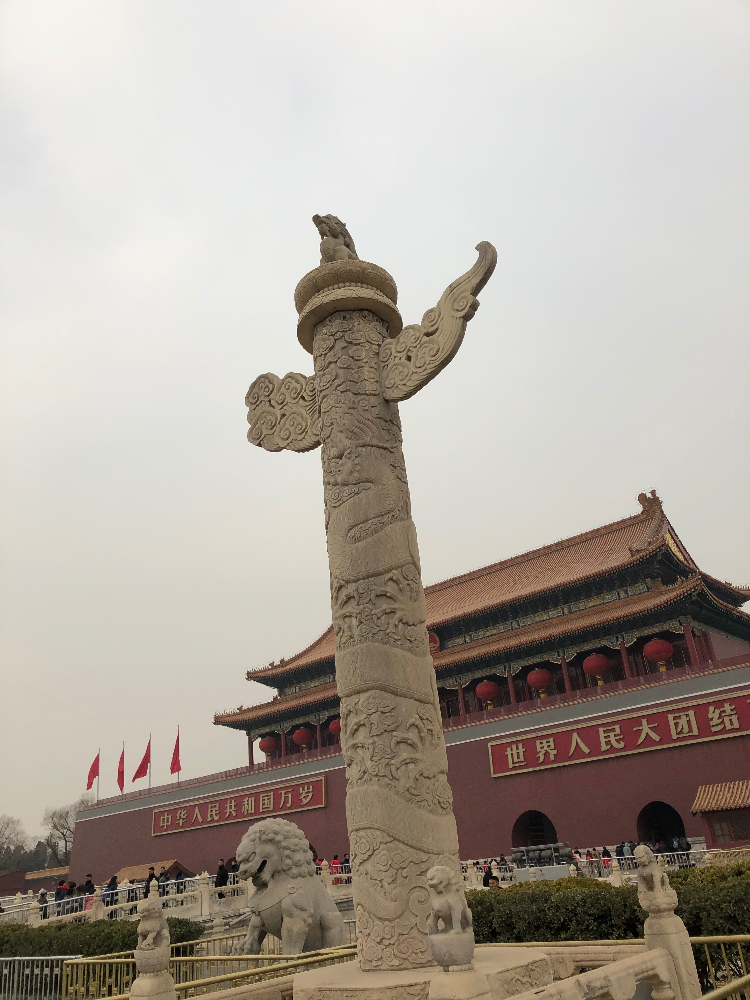
我们坐上火车，我的心情很激动，想到要见到爸爸了，我真的想在火车上面跳一跳。我趴着窗口看着窗外的风景，想着见到爸爸的情景，心里真的好开心呀！
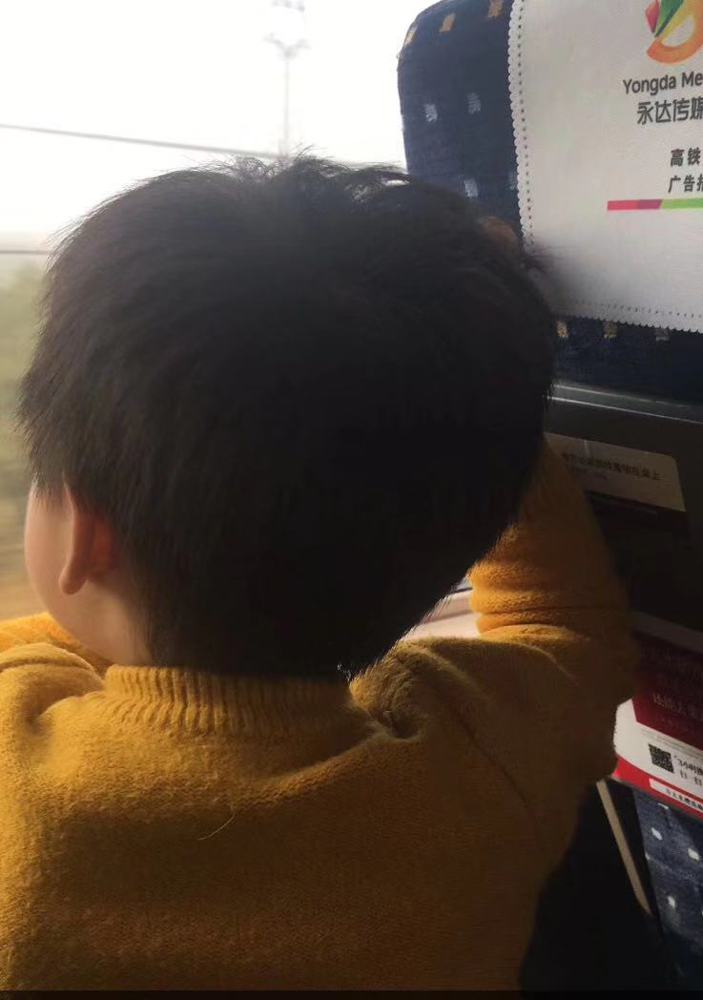
见到了我的爸爸，爸爸别提有多高兴了，立马就带着我们去吃我爱吃的汉堡、薯条🍟。哎呀，我的小心脏呀，就要飞起来了！
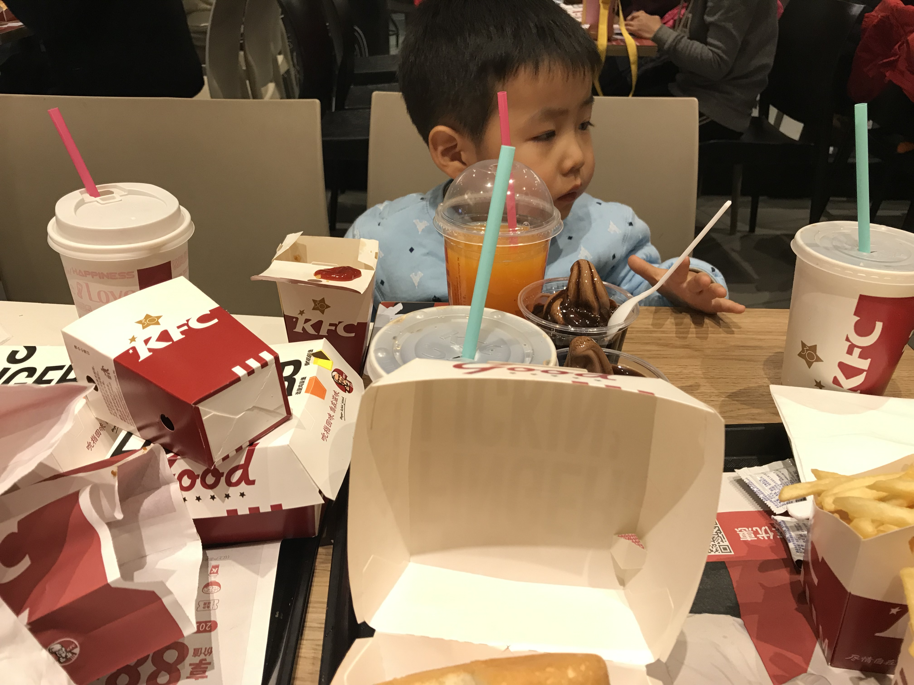

到了第二天，由于爸爸还没有放假，还要继续上班，但我才见到爸爸，我不想离开的太长时间，看到爸爸又要去上班了，我就拿出我的绝招，开始大哭起来😭，抱着爸爸不让走，后来爸爸没有办法只好带着我去他们公司了。
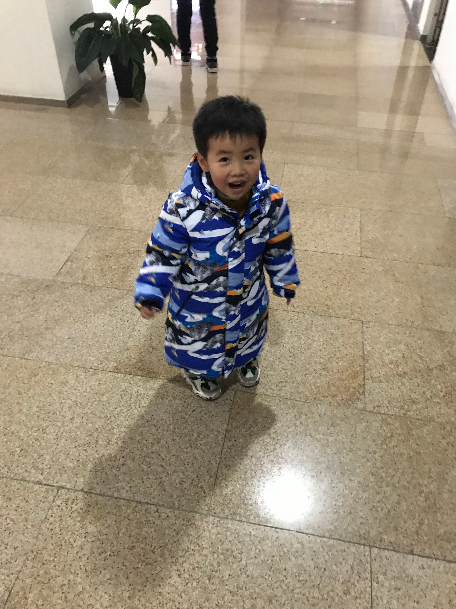
来到爸爸工作的地方，爸爸给我买了我最爱吃薯饼、饼干、牛奶和一大堆零食，可好吃了。

在寒假期间我和爸爸妈妈还有哥哥们一起去了很多好玩的地方，长城、故宫、北戴河...
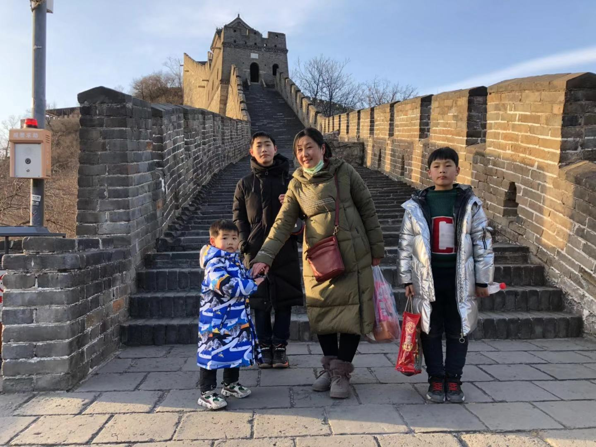
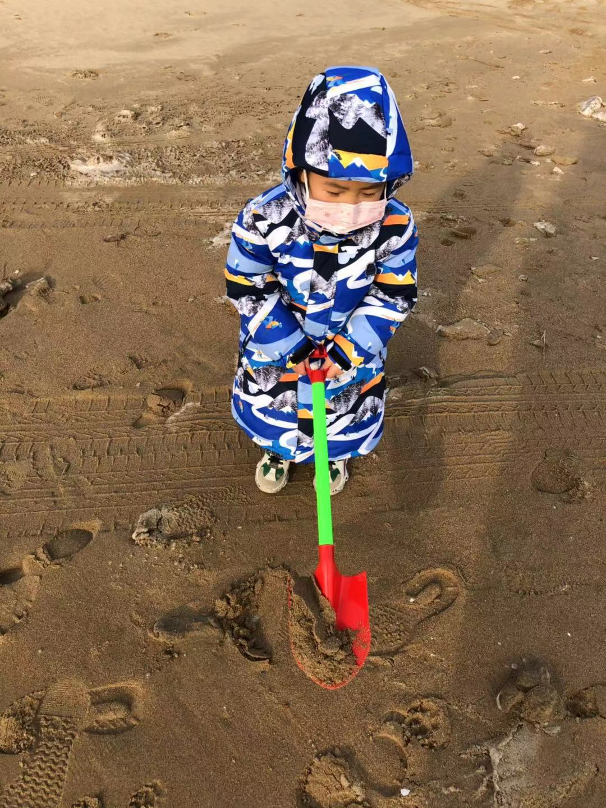

爸爸带我们来冰上玩，可有意思了，还有人打陀螺
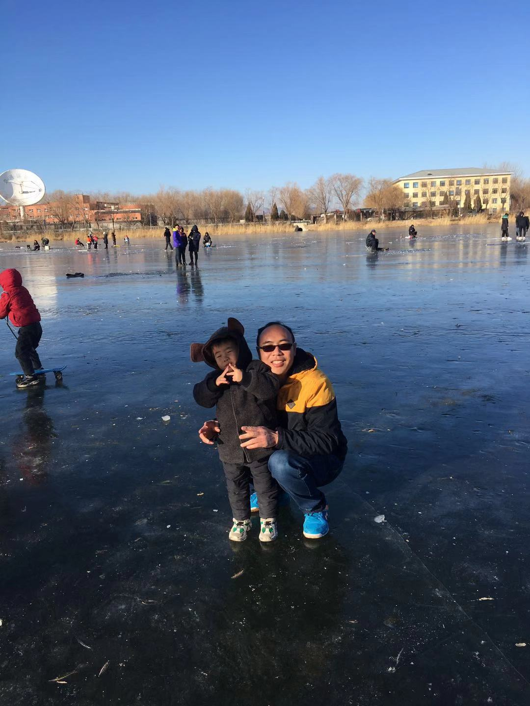
冰面好多裂纹，吓死我了，赶紧离开^_^
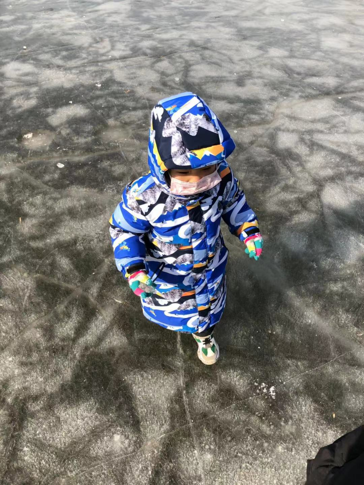
我坐在爸爸牵着的雪圈里，可带劲了
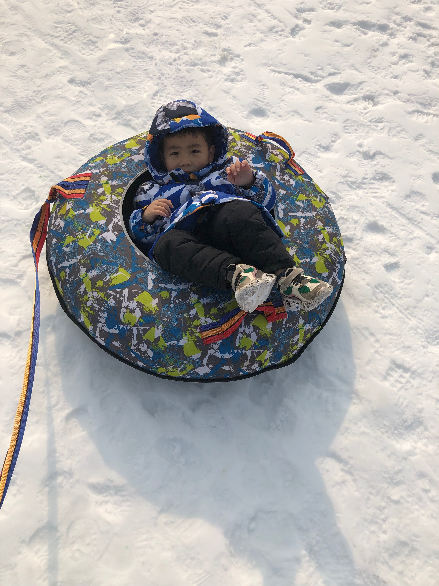

在这期间，爸爸就带着妈妈和我们三兄弟逛遍了北京城，我在这里见到了以前我见不到的很多东西，欣赏了很多秀丽风景，顺便也吃了很多好吃的、玩了很多好玩的。
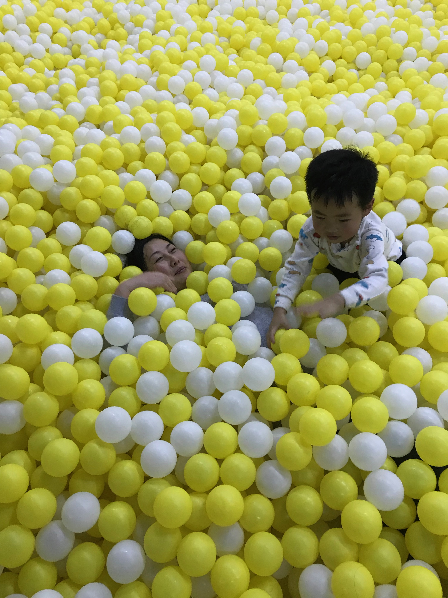
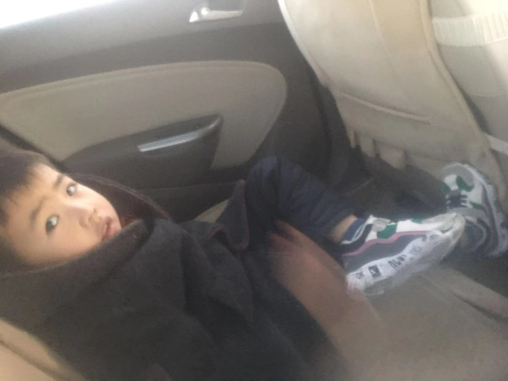
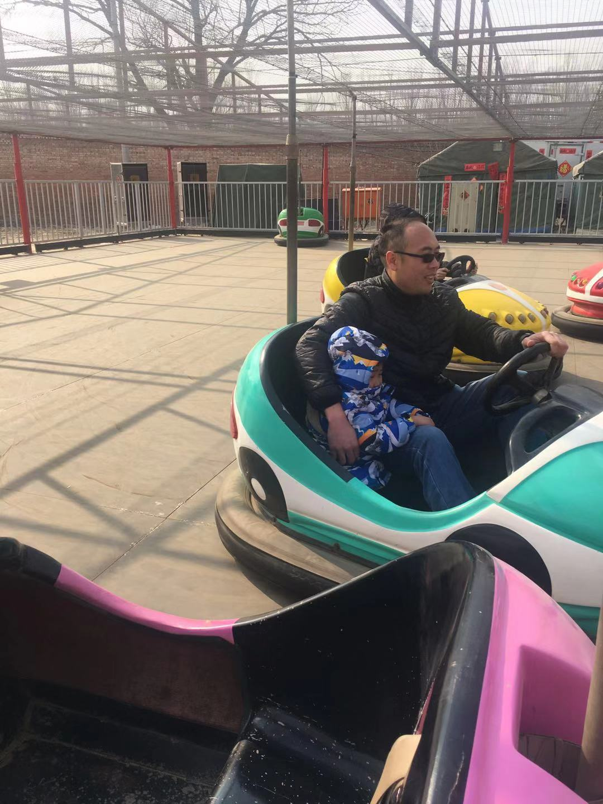
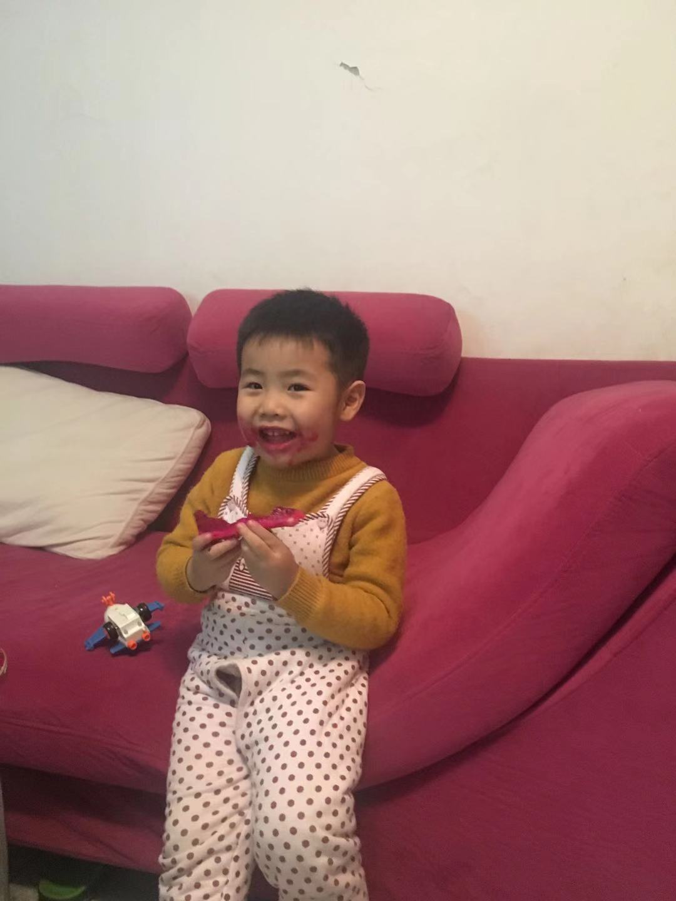

这个寒假我过真的太舒心了
也是我过的一个难忘的寒假。